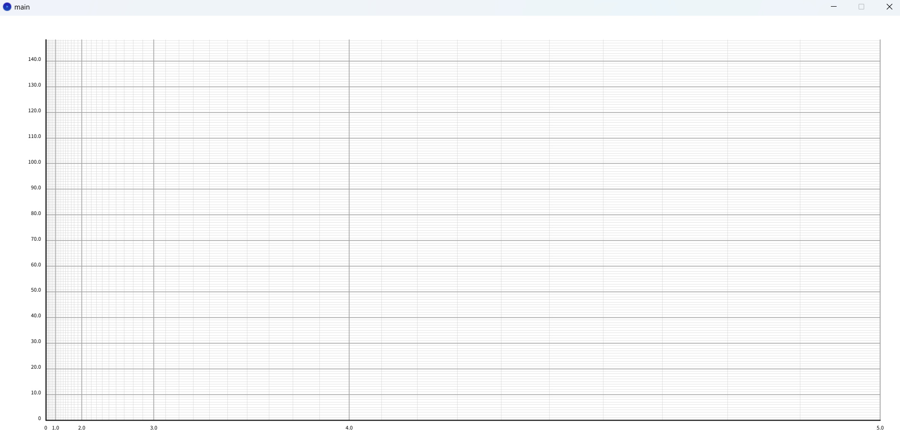
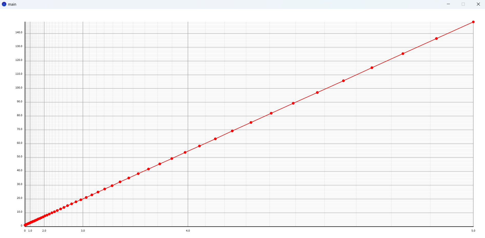
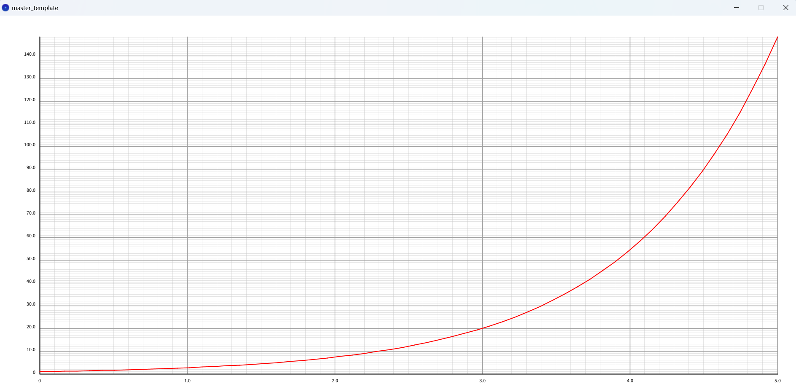

# Y / e^X Grid experiment

## Experiment 1

An experiment to produce the grid of y over e^x

## Experiment 2

An experiment to produce a straight line of y = e^x on a grid with axis of y over e^x

A graph of y = e^x on a normal, linear scale for refrence

## Experiment successful   Found a way to implement custom scales on GP object
