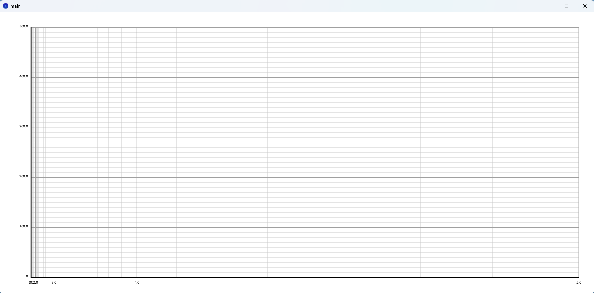
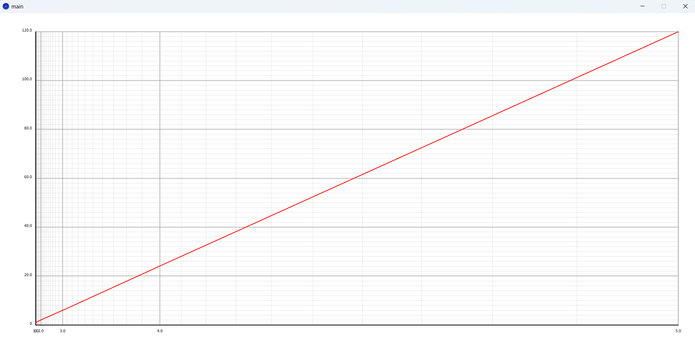
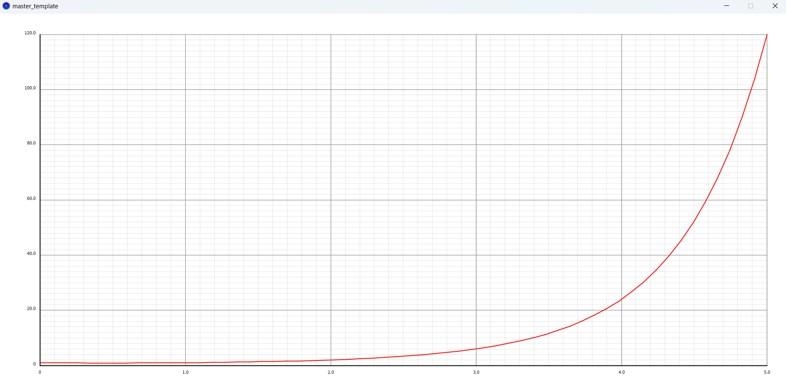

# Y / X! Grid experiment

## Experiment 1

An experiment to produce the grid of y over x!

## Experiment 2

An experiment to produce a straight line of y = x! on a grid with axis of y over x!

A graph of y = x! on a normal, linear scale for refrence

## Experiment successful   Found a way to implement custom scales on GP object
